# 🚀 AI-Powered Outlier Detection Pipeline
### *Detecting Semantic Anomalies with Embeddings & Machine Learning*

[](https://choosealicense.com/licenses/mit/)
[](https://www.python.org/downloads/)
[](https://scikit-learn.org/)

We know that real-world data cannot be transformed into perfect clusters. It's filled with hidden outliers that can silently corrupt analytics, skew ML models, and lead to flawed business decisions. 🎯

Detecting these anomalies was traditionally a purely statistical game. But now that we have embeddings and Large Language Models (LLMs), we can transform this process. By integrating AI with traditional machine learning, we can build pipelines that don't just find outliers based on numbers, **but on semantic meaning**. 🧠✨

## 🎯 Pipeline Overview

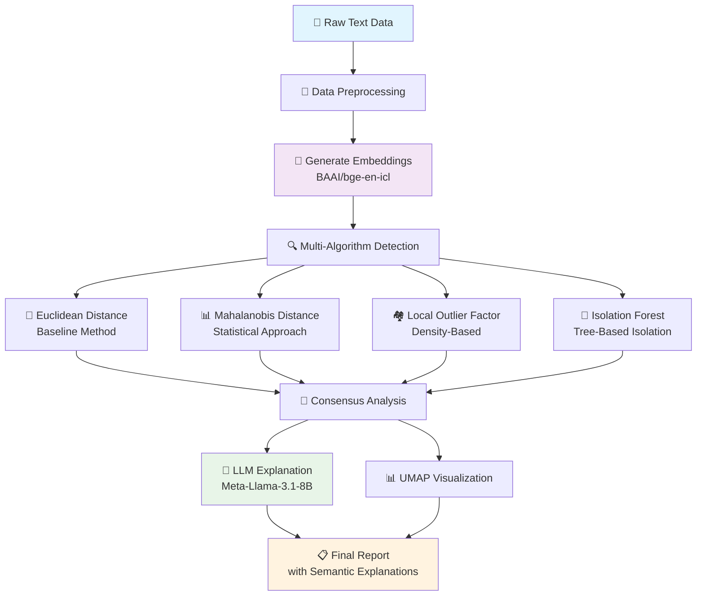


## 🔧 Key Pipeline Components

Our comprehensive approach consists of **5 essential stages**:

1. **🧹 Standardize the Dataset:** Start with raw, unstructured text and apply cleaning techniques to prepare it for our AI models.
2. **🔢 Generate High-Dimensional Embeddings:** Use a powerful AI model to convert clean text into rich numerical vectors that capture semantic meaning.
3. **🔍 Detect Anomalies with Multiple ML Algorithms:** Run a suite of classic and advanced algorithms to identify potential outliers from different perspectives.
4. **✅ Validate Embeddings with Unsupervised Clustering:** Perform a critical sanity check to confirm that our embeddings have successfully organized the data into meaningful groups.
5. **🤖 Generate Semantic Explanations with an LLM:** Use an LLM to automatically explain why a document is an outlier, turning a simple alert into an actionable insight.

## 📚 Table of Contents

- [🚀 Quick Start](#-quick-start)
- [🏗️ System Architecture](#️-system-architecture)
- [📖 Methodology Deep Dive](#-methodology-deep-dive)
  - [🛠️ Setting Up the Environment](#️-setting-up-the-environment)
  - [📊 Understanding and Standardizing our Dataset](#-understanding-and-standardizing-our-dataset)
  - [🔢 Generating High-Dimensional Embeddings](#-generating-high-dimensional-embeddings)
  - [❌ Why Euclidean Distance Approach Never Works](#-why-euclidean-distance-approach-never-works)
  - [📊 Statistical Outliers with Mahalanobis Distance](#-statistical-outliers-with-mahalanobis-distance)
  - [🏘️ Density-Based Outliers with Local Outlier Factor (LOF)](#️-density-based-outliers-with-local-outlier-factor-lof)
  - [🌲 Isolation-Based Outliers with Isolation Forest](#-isolation-based-outliers-with-isolation-forest)
  - [🤝 Comparative Analysis](#-comparative-analysis)
  - [🤖 Semantic Explanation using Explainable AI](#-semantic-explanation-using-explainable-ai)
  - [✅ Validating Our Embeddings with Unsupervised Clustering](#-validating-our-embeddings-with-unsupervised-clustering)
- [🚀 Future Directions](#-future-directions)
- [💻 Code Examples](#-code-examples)

## 🚀 Quick Start

### Prerequisites
- Python 3.8+
- OpenAI-compatible API key (Nebius, OpenAI, or local LLM)

### Installation

```bash
git clone https://github.com/bshongwe/ai-outlier-detection.git
cd ai-outlier-detection
pip install -r requirements.txt
make setup  # Set up environment
```

### Run the Pipeline

**Option 1: Command Line Interface**
```bash
# Run complete pipeline
python cli.py run

# Analyze custom texts
python cli.py detect "Your text here" "Another text" --category tech

# Analyze CSV file
python cli.py analyze-file data.csv --text-column content
```

**Option 2: Web API**
```bash
# Start FastAPI server
python api.py
# Visit http://localhost:8000/docs for interactive API
```

**Option 3: Python Code**
```python
from src.pipeline import AIOutlierDetectionPipeline

pipeline = AIOutlierDetectionPipeline()
results = pipeline.detect_outliers_in_text(["Your texts here"])
```

**Option 4: Docker**
```bash
docker-compose up  # Runs API server
# or
make docker-run
```

## 🏗️ System Architecture

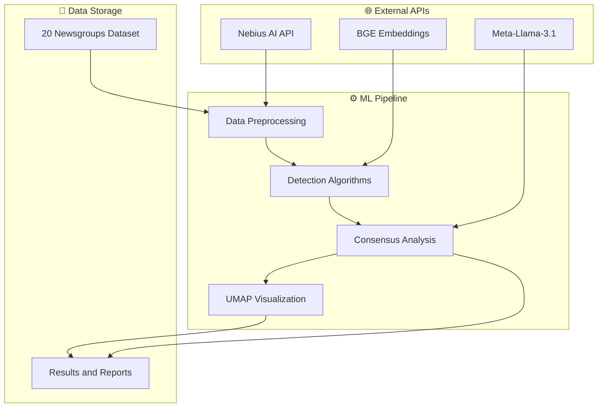

## 📖 Methodology Deep Dive

### 🛠️ Setting Up the Environment

To effectively detect anomalies in our data pipelines, we integrate **three key components**:

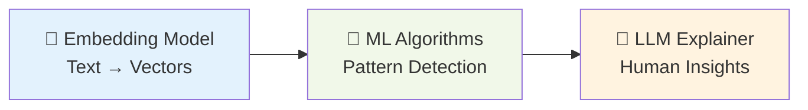

1. **🔢 Embedding Model:** Converts text data into numerical vectors for computation and analysis
2. **🧠 Machine Learning Algorithms:** Cluster embeddings and detect anomalies based on patterns in vector space
3. **🤖 Explainable AI / LLMs:** Validate detected anomalies and provide human-readable explanations

#### Core Dependencies

```python
# Essential Libraries
import numpy as np              # 📊 Numerical Computing
import pandas as pd             # 📋 Data Manipulation
import matplotlib.pyplot as plt # 📈 Visualization
import seaborn as sns          # 🎨 Statistical Plotting
from tqdm.auto import tqdm     # ⏱️ Progress Tracking

# Machine Learning Stack
from sklearn.neighbors import LocalOutlierFactor      # 🏘️ LOF Algorithm
from sklearn.ensemble import IsolationForest          # 🌲 Isolation Forest
from sklearn.cluster import KMeans                    # 🎯 Clustering
from scipy.spatial.distance import mahalanobis       # 📊 Distance Metrics
from scipy.stats import chi2                          # 📈 Statistical Tests

# AI Integration
from openai import OpenAI      # 🤖 LLM Integration
```

### 📊 Understanding and Standardizing our Dataset

We use the **[20 Newsgroups dataset](https://www.kaggle.com/datasets/crawford/20-newsgroups)** 📰, a well-known dataset that contains inherent clustering challenges perfect for testing anomaly detection methods.

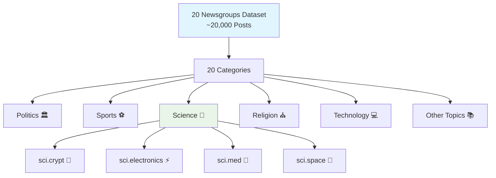

#### Dataset Characteristics:
- **📈 Size:** ~20,000 newsgroup posts
- **🏷️ Categories:** 20 distinct topics
- **📅 Origin:** Compiled by Ken Lang (1995)
- **🎯 Focus:** Science categories for clearer analysis

#### Data Cleaning Pipeline

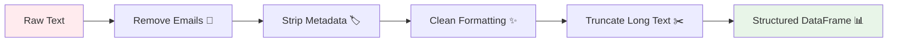

Our cleaning process includes:
- **📧 Email Removal:** Strip email addresses and parenthetical content
- **🏷️ Metadata Cleaning:** Remove headers, subjects, and line markers
- **✂️ Text Truncation:** Limit to 2000 characters for efficiency
- **📊 DataFrame Structure:** Organize data with labels and class names

### 🔢 Generating High-Dimensional Embeddings

We use the **`BAAI/bge-en-icl`** model for its superior performance in semantic similarity tasks. This model maps text into a **4096-dimensional vector space** where distance reflects semantic meaning.

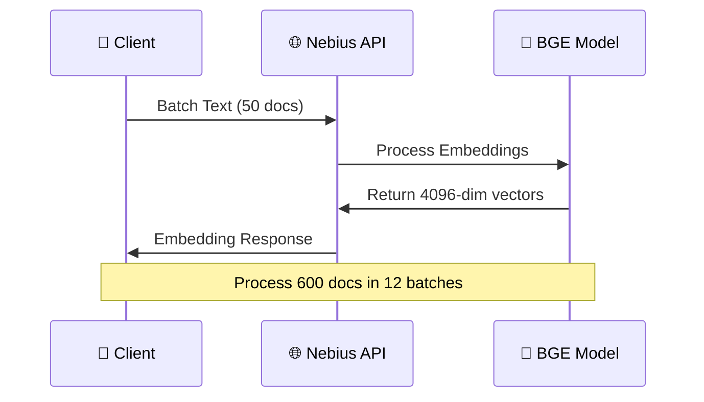

**Key Features:**
- **📏 Dimensions:** 4096-dimensional vectors
- **⚡ Batch Processing:** 50 documents per API call
- **🎯 Semantic Focus:** Captures meaning, not just keywords
- **🔄 Efficient Processing:** ~31 seconds for 600 documents

### ❌ Why Euclidean Distance Approach Never Works

The Euclidean method fails because it assumes **perfect spherical clusters** 🔵 - a rare occurrence in real-world data.

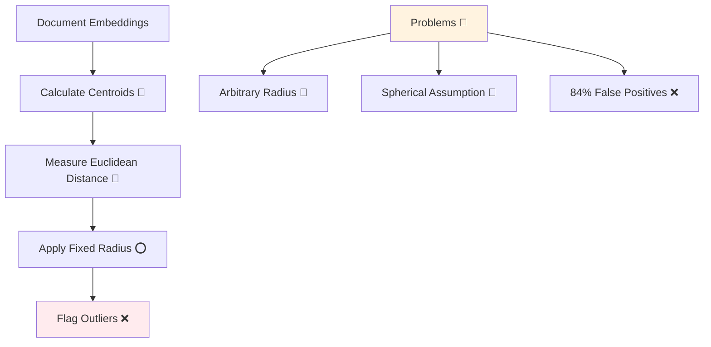

**Major Issues:**
- **🎯 Arbitrary Threshold:** No statistical basis for radius selection
- **🔵 Spherical Assumption:** Real clusters are complex, elongated shapes
- **❌ High False Positives:** 506/600 documents flagged (84% error rate)

### 📊 Statistical Outliers with Mahalanobis Distance

The Mahalanobis approach accounts for cluster **shape and spread** by using covariance matrices:

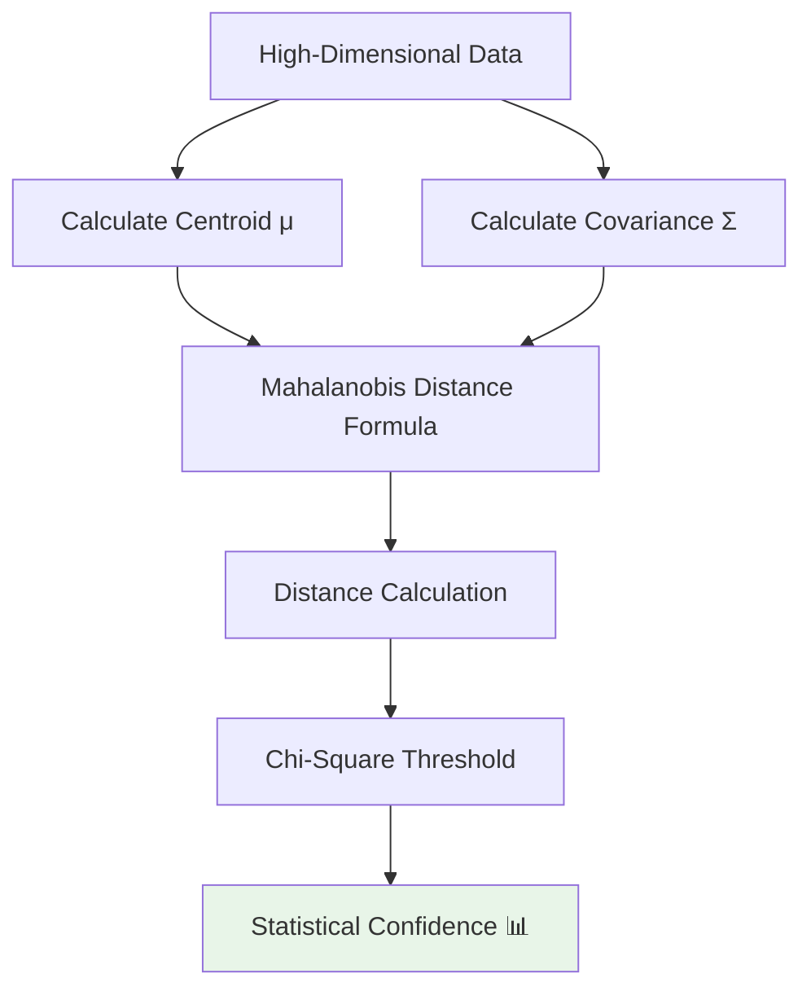

**Formula Components:**
- **D²:** Mahalanobis distance (shape-aware)
- **x:** Document embedding vector
- **μ:** Cluster centroid (mean)
- **Σ:** Covariance matrix (shape descriptor)
- **Σ⁻¹:** Inverse covariance (re-weighting factor)

**Results:** 0 outliers at 99% confidence - indicates well-formed clusters! ✅

### 🏘️ Density-Based Outliers with Local Outlier Factor (LOF)

LOF identifies **lonely points** in sparse regions using local density comparison:

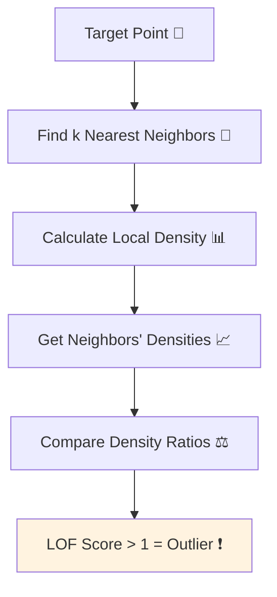

**Algorithm Steps:**
1. **👥 Neighbor Analysis:** Find k-nearest neighbors (k=20)
2. **📊 Density Calculation:** Measure local point concentration
3. **📈 Neighbor Comparison:** Check neighbors' own densities
4. **⚖️ Ratio Analysis:** Compare relative isolation levels

**Results:** 0 outliers - confirms uniform cluster density! ✅

### 🌲 Isolation-Based Outliers with Isolation Forest

This method works on a brilliant principle: **anomalies are easier to isolate** than normal points.

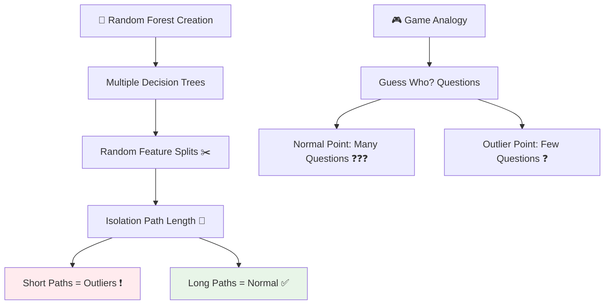

**Key Insight:** Outliers require fewer "questions" (splits) to isolate from the group.

**Configuration:**
- **🌱 Contamination:** 5% expected outlier rate
- **🎲 Random State:** 42 for reproducibility
- **🎯 Success:** Found exactly 30 outliers (5% of 600 documents)

### 🤝 Comparative Analysis

Our multi-algorithm approach reveals different perspectives on the same data:

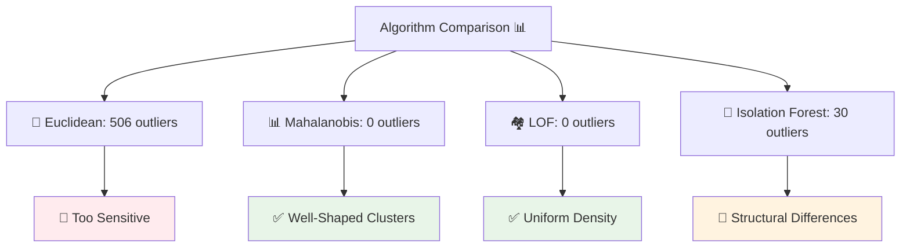

**Consensus Analysis:**
- **High-Confidence Outliers:** Flagged by ALL advanced methods = 0
- **Most Actionable:** Isolation Forest results (30 structural anomalies)
- **Data Quality:** Clean, well-formed clusters confirmed

### 🤖 Semantic Explanation using Explainable AI

Transform numerical anomaly scores into **human-readable insights** using LLMs:

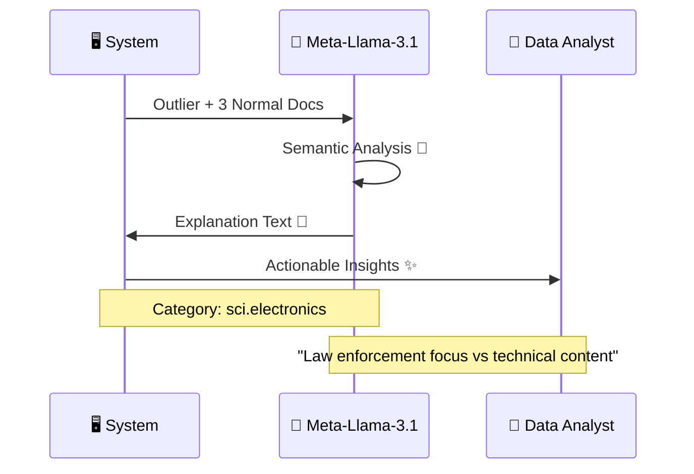

**Process:**
1. **📄 Input Preparation:** Select 1 outlier + 3 normal documents from same category
2. **🧠 LLM Analysis:** Use Meta-Llama-3.1-8B-Instruct for semantic comparison
3. **📝 Explanation Generation:** Receive human-readable insights
4. **✨ Actionable Output:** Transform alerts into understanding

**Example Output:**
> *"The outlier document discusses radar detector detectors and law enforcement policy, while other sci.electronics documents focus on technical specifications and repair questions."*

### ✅ Validating Our Embeddings with Unsupervised Clustering

Test embedding quality by attempting to **rediscover original categories** without labels:

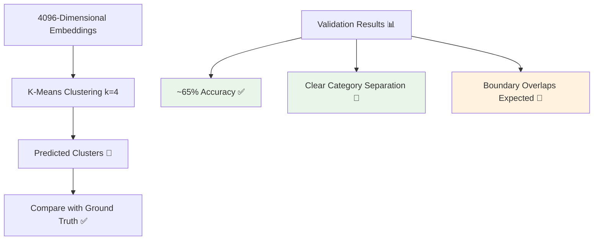

**K-Means Process:**
1. **🎯 Random Initialization:** Place 4 centroids randomly
2. **📍 Assignment:** Assign documents to nearest centroid
3. **🔄 Iteration:** Recalculate centroids and reassign
4. **✅ Convergence:** Stop when assignments stabilize

**Validation Success:**
- **✅ ~65% Accuracy:** Strong unsupervised performance
- **🎯 Clear Separation:** Distinct topic groups rediscovered
- **🤝 Natural Overlaps:** Boundary confusion in complex documents

## 🚀 Future Directions

Our pipeline demonstrates a modern, comprehensive approach to semantic anomaly detection. Here are the next evolution steps:

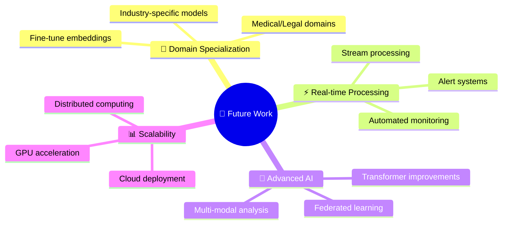

### 🎯 Domain-Specific Fine-Tuning
- **🏥 Medical Texts:** Fine-tune on medical literature for clinical anomalies
- **⚖️ Legal Documents:** Adapt for contract and legal text analysis
- **💼 Business Intelligence:** Customize for industry-specific content

### ⚡ Fully Automated Monitoring
- **📡 Real-time Ingestion:** Process streaming data continuously
- **🚨 Alert Systems:** Automated notifications with LLM explanations
- **📧 Report Generation:** Scheduled insights delivery

### 🧠 Advanced AI Integration
- **🖼️ Multi-modal Analysis:** Combine text, images, and metadata
- **🔄 Continuous Learning:** Adaptive models that improve over time
- **🌐 Federated Approaches:** Privacy-preserving distributed training

## 💻 Code Examples

### 🚀 Quick Pipeline Usage

```python
from src.pipeline import AIOutlierDetectionPipeline

# Initialize pipeline
pipeline = AIOutlierDetectionPipeline()

# Analyze custom texts
texts = [
    "Machine learning is transforming industries",
    "Deep learning models process complex data", 
    "My favorite pizza topping is pepperoni"  # Outlier
]

results = pipeline.detect_outliers_in_text(texts)
print(f"Isolation Forest found {results['IsolationForest']['outlier_count']} outliers")
```

### 🌐 API Usage

```python
import requests

# Start API server first: python api.py
response = requests.post(
    "http://localhost:8000/analyze/texts",
    json={
        "texts": ["Tech document", "Cooking recipe"],
        "categories": ["technology", "food"]
    }
)

results = response.json()
print(results)
```

### 📈 Advanced Visualization

```python
from src.visualizer import OutlierVisualizer

# Create visualizer
viz = OutlierVisualizer()

# Project embeddings to 2D
df_viz = viz.project_embeddings_2d(df_with_embeddings)

# Plot outliers
viz.plot_outliers(df_viz, 'Outlier_IsolationForest', 
                 title='Semantic Outliers Detected')

# Compare multiple methods
outlier_columns = ['Outlier_IsolationForest', 'Outlier_LOF']
viz.plot_comparison(df_viz, outlier_columns)
```

### 🔧 Development Tools

```bash
# Run tests
make test

# Format code
make format

# Run linting
make lint

# Performance benchmark
python benchmark.py

# Demo all features
python examples/demo.py
```

---

## 📄 License

This project is licensed under the MIT License - see the [LICENSE](LICENSE) file for details.

## 🤝 Contributing

Contributions are welcome! Please feel free to submit a Pull Request. For major changes, please open an issue first to discuss what you would like to change.

## 📧 Contact

**Ernest B. Shongwe** - [@bshongwe](https://github.com/bshongwe)

Project Link: [https://github.com/bshongwe/ai-outlier-detection](https://github.com/bshongwe/ai-outlier-detection)

---

<div align="center">

**⭐ Star this repo if you find it helpful! ⭐**

*Built with ❤️ for the data science community*

</div>
